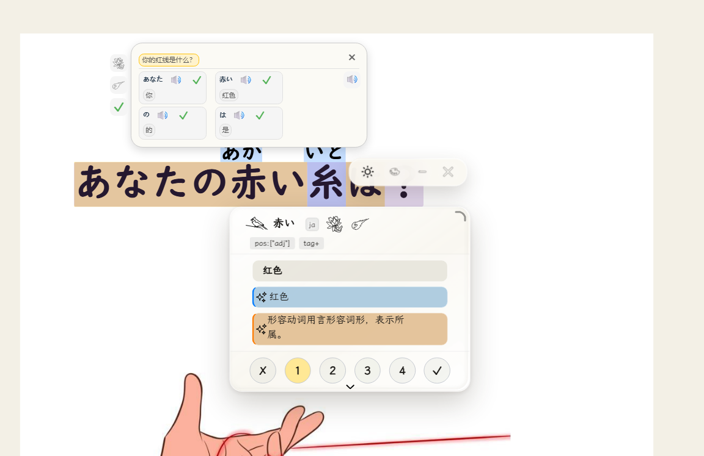
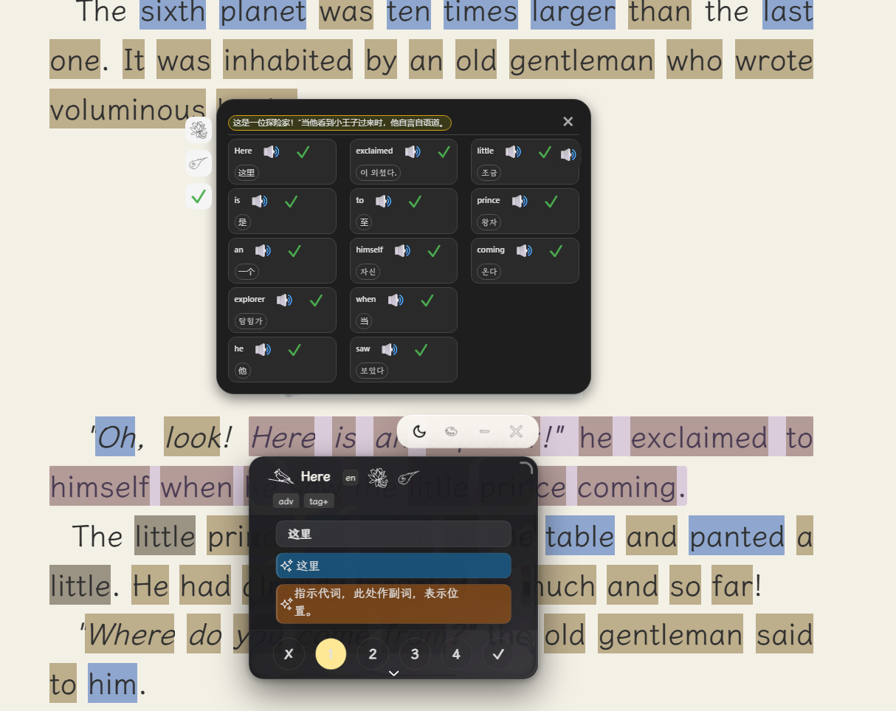
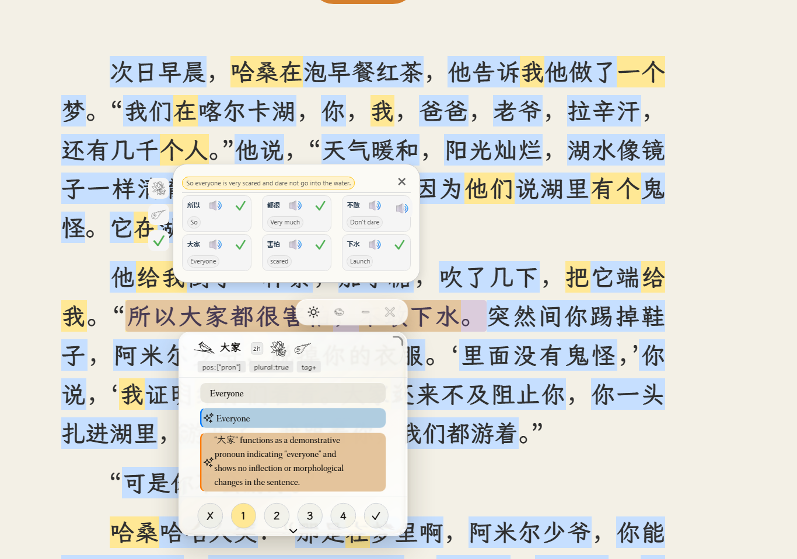
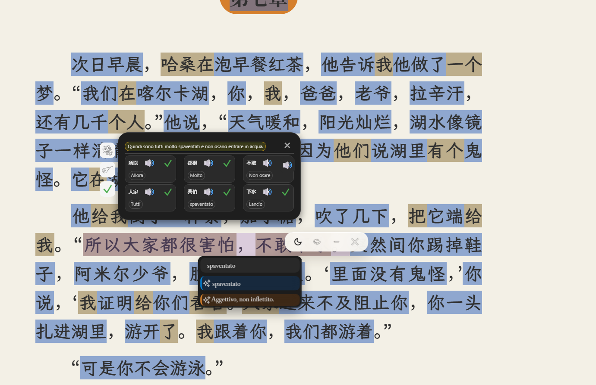
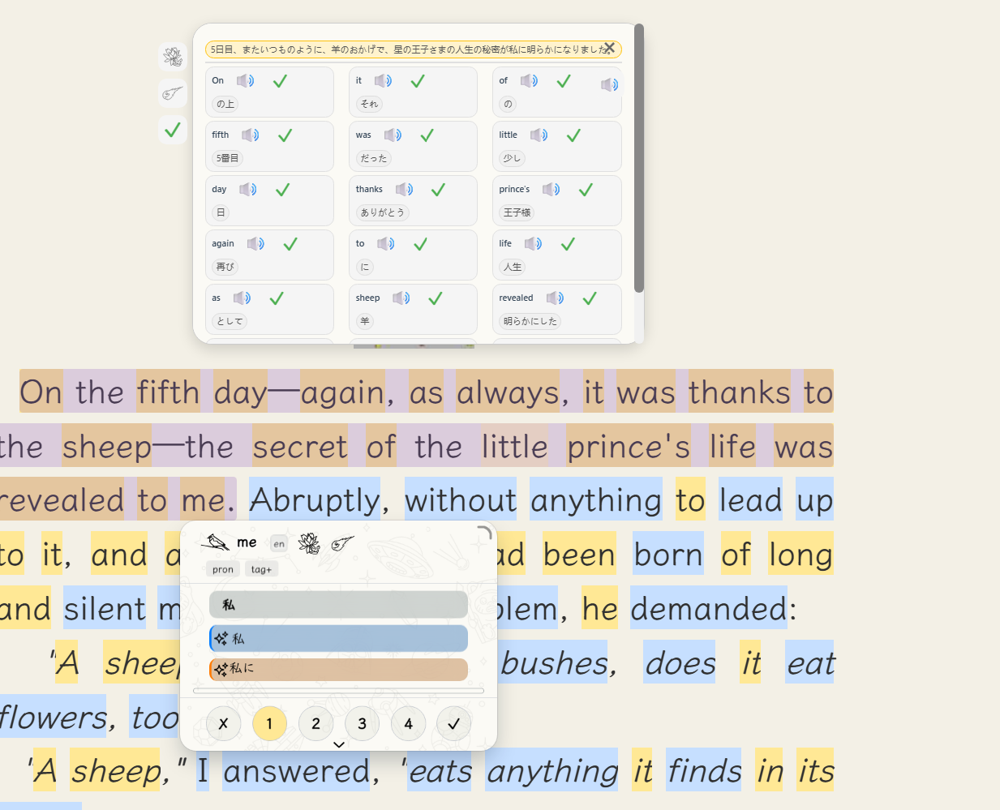

# LingKuma for Calibre

[English](../README.md) | [简体中文](README_zh.md) | [日本語](README_ja.md) | [한국어](README_ko.md)

**See it. Click it. Learn it.**

LingKuma —— *言語の壁を越えて、知識を広げるために* —— は、読書を中心に設計された翻訳・語学学習ツールです。

ある言語を「学び終える」まで、その言語で書かれた本やその他のコンテンツを読むのを待つ必要はありません。

知らない単語に出会ったら、**クリック**。  
理解しにくい文に出会ったら、**クリック**。

LingKuma は、まだ学習途中の言語で書かれたコンテンツを読むことをサポートします。読書を楽しみながら自然に語彙を増やし、文法や表現に慣れ、その言語への理解を深めることができます。

> **まず読書を楽しみ、その過程で新しい言語を学ぶ。**

## LingKuma でできること

- 単語をクリックして意味を確認
- 文全体の翻訳と分析
- TTS による単語の発音
- 読書をしながら語彙を学習
- AI による文法と文脈の説明
- 複数言語間の翻訳
- ライトテーマとダークテーマ
- Calibre 内でも LingKuma 本来のスタイルを維持したインターフェース

## スクリーンショット

  
  

  
  

  

## Calibre 移植版

これはオープンソースプロジェクト LingKuma の非公式 Calibre 移植版です。

Calibre 移植版では、以下の対応を追加しています：

- Calibre / Qt WebEngine 実行環境への対応
- EPUB と PDF 閲覧時の文選択を改善
- 日本語・韓国語の短文認識に対応
- Calibre に対応したすりガラス効果
- 多言語翻訳および AI 出力への対応
- Calibre の読書環境との統合

## インストール

1. **GitHub Releases** から `lingkuma-calibre-1.0.zip` をダウンロードします。
2. **Calibre → 設定 → プラグイン** を開きます。
3. **ファイルからプラグインを読み込む** を選択します。
4. ダウンロードした `lingkuma-calibre-1.0.zip` を選択します。
5. Calibre を再起動します。

> GitHub が自動生成する `Source code (zip)` はインストールしないでください。Release に添付されている `lingkuma-calibre-1.0.zip` プラグインパッケージを使用してください。

## その他のバージョン

- [LingKuma for Zotero](https://github.com/white-ink-cell/lingkuma-zotero)
- [LingKuma](https://github.com/lingkuma/LingKuma)

## 対応環境

- Calibre 9.x
- EPUB および PDF の読書
- Windows / macOS / Linux

## 設定

設定画面は Calibre に統合されています。言語と AI の設定、語彙管理、TTS オプション、外観設定、オプションの WebDAV バックアップ / 復元機能を利用できます。

## プライバシー

LingKuma for Calibre はローカルの状態を Calibre のプラグインデータディレクトリに保存します。翻訳、AI、リモート TTS、WebDAV の各機能では、選択したサービスを利用するために必要なテキストまたはデータが送信される場合があります。通常の単語翻訳や文翻訳のために、電子書籍または PDF ファイル全体を意図的にアップロードすることはありません。

## 上流プロジェクトとクレジット

- オリジナルプロジェクト：**LingKuma**
- 上流バージョン：**LingKuma 1.1.0**
- Calibre 移植版のメンテナンスおよび公開：**white-ink-cell**

このリポジトリは LingKuma の非公式 Calibre 移植版を提供します。

この移植版では、LingKuma を Calibre の読書環境に適応させながら、オリジナルプロジェクトの主要機能、インターフェース、アセット、全体的なデザインを可能な限り維持しています。Calibre 向けの変更は、主に実行環境の互換性、文選択、すりガラス効果、多言語翻訳への対応に重点を置いています。

詳細については `UPSTREAM.md` を参照してください。

## ライセンス

オリジナル LingKuma の作者表記、著作権、ライセンスは変更されていません。

Calibre アダプターおよび互換レイヤーには `LICENSE-ADAPTER.txt` のライセンスが適用されます。オリジナル LingKuma のライセンスは `LICENSE-LINGKUMA.txt` に保持されており、同梱されているサードパーティのライセンスおよび通知は `THIRD-PARTY-NOTICES.txt` に記載されています。
